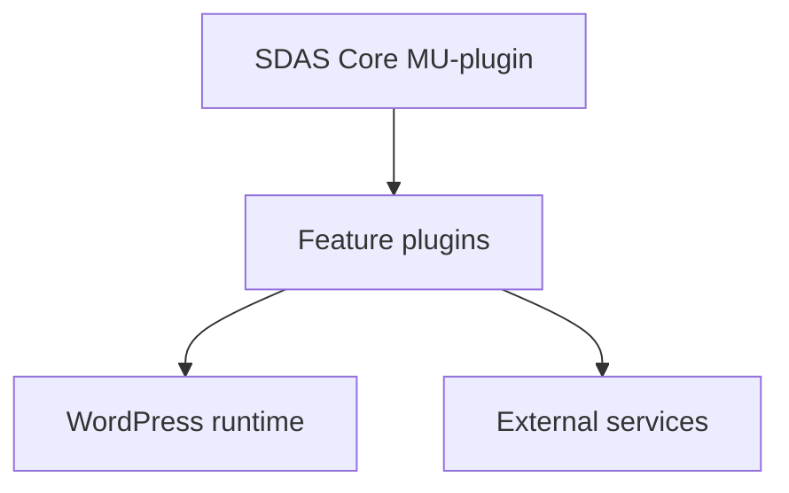
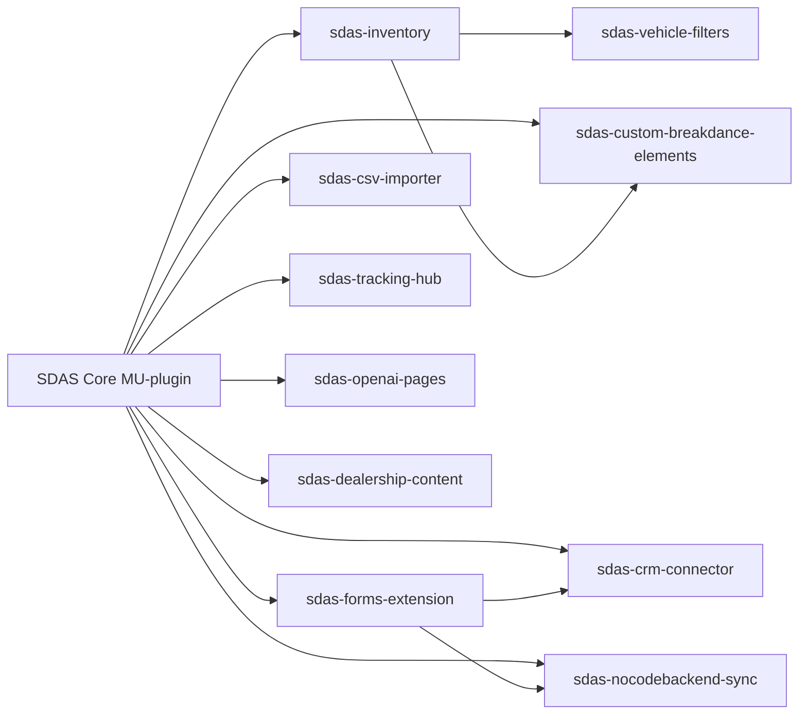

## High-level architecture

SDAS is a set of coordinated WordPress plugins built around a Core MU-plugin that provides shared infrastructure and services for feature plugins.

The Core layer centralizes logging, error handling, security, and shared integrations such as the OpenAI client and database helpers. Feature plugins rely on this foundation to implement specific dealership workflows like inventory, leads, CRM sync, and tracking.

<Callout kind="info">

The SDAS Core plugin runs as a must-use (MU) plugin. WordPress loads MU-plugins before all normal plugins and they cannot be deactivated through the standard Plugins screen. This guarantees that shared services such as logging, security headers, and the OpenAI client are always available to dependent SDAS feature plugins.

</Callout>

### Component map

SDAS components group into three layers:

- **Core infrastructure**
  - SDAS Core (MU-plugin)
- **Domain feature plugins**
  - Inventory, vehicle filters, forms/lead processing, CRM connector, CSV importer, tracking hub, OpenAI pages, dealership content, Breakdance elements, NoCodeBackend sync
- **External systems**
  - OpenAI API, CRMs, analytics platforms, NoCodeBackend API, dealership sites and front-ends

SDAS Core sits underneath the feature plugins and exposes shared services they call into; feature plugins then expose CPTs, shortcodes, REST endpoints, admin screens, and background jobs to WordPress and integrate with external systems as needed.

## SDAS Core (MU-plugin)

SDAS Core is the foundational layer that all other SDAS plugins depend on. It focuses on cross-cutting concerns and shared tooling rather than user-facing features.

Core responsibilities include:

- **Logging and error handling**
  - Central error handler and shutdown function
  - Log manager abstraction for consistent error, warning, and usage logging
- **Security and stability**
  - Security headers for frontend and admin requests
  - Health monitoring hooks to expose internal status
  - Input validation helpers
- **Shared integrations**
  - Secure token storage for API keys and secrets
  - OpenAI API client wrapper
  - Database index and schema tooling for SDAS tables and CPTs
- **Operational visibility**
  - Usage tracking utilities that feature plugins can call
  - Shared SDAS admin menus and navigation for configuration screens

Feature plugins should treat SDAS Core as the single source of truth for logging, secrets, and OpenAI access rather than rolling their own infrastructure.

## Feature plugins and responsibilities

Each SDAS feature plugin implements a focused part of the dealership stack. They share a common dependency on SDAS Core but are otherwise decoupled so that you can enable only the pieces you need.

### Inventory and vehicle discovery

These plugins power vehicle storage, display, and discovery.

- **sdas-inventory**
  - Declares the **vehicle inventory custom post type** and related taxonomies/meta
  - Provides **shortcodes and templates** for vehicle detail and listing pages
  - Implements **awards scraping** and storage for vehicles
  - Defines the **vehicle schema** used by other plugins for consistent data access
  - Integrates with the **description generator**, likely via the shared OpenAI client in SDAS Core
- **sdas-vehicle-filters**
  - Adds **AJAX-based filtering** for inventory listings
  - Manages **caching** for filter results to reduce query costs
  - Depends on the vehicle schema from `sdas-inventory` to construct queries and responses

In practice, `sdas-vehicle-filters` expects `sdas-inventory` to be active, since filters operate on the inventory CPT and metadata.

### Forms, leads, and CRM

These plugins handle lead capture from forms and downstream synchronization into CRMs and NoCodeBackend.

- **sdas-forms-extension**
  - Integrates with **WPForms** to enhance lead capture flows
  - Provides an **ADF (Auto-lead Data Format) builder** for leads
  - Maintains an **audit trail** for lead-related actions
  - Implements **lead processing pipelines**, likely calling into SDAS Core logging and usage tracking
- **sdas-crm-connector**
  - Synchronizes leads and related data to **CRM systems**
  - Uses a **queue** to manage outbound sync operations
  - Implements a **circuit breaker** pattern to protect against failing CRM endpoints
  - Supports **field mapping**, translating internal lead fields to CRM-specific schemas
- **sdas-nocodebackend-sync**
  - Syncs **leads and vehicle snapshots** to the **NoCodeBackend API**
  - Likely reuses the same lead payloads produced by `sdas-forms-extension`
  - Relies on secure token storage from SDAS Core for the NoCodeBackend credentials

`sdas-forms-extension` typically runs first in the flow to accept and normalize lead data. `sdas-crm-connector` and `sdas-nocodebackend-sync` then consume that normalized data and handle external delivery.

### Data ingestion and background processing

These plugins handle bulk data ingestion and long-running tasks.

- **sdas-csv-importer**
  - Implements a **CSV import pipeline** for vehicle data or related domain records
  - Uses **background processing** to avoid timeouts on large imports
  - Supports **image reprocessing**, such as resizing or regenerating thumbnails after import
  - Likely uses SDAS Core logging and health monitoring to track import status

Other plugins, particularly `sdas-inventory`, benefit from data imported by `sdas-csv-importer` into standard CPTs and meta fields.

### Tracking and analytics

These plugins manage server-side tracking and attribution.

- **sdas-tracking-hub**
  - Implements **server-side tracking** endpoints and dispatchers
  - Sends events to **GA4, Google Ads, and Meta** platforms
  - Maintains **attribution data** to tie events to sessions or users
  - Uses **queues and retries** to ensure delivery to external analytics APIs
  - Likely logs tracking events and errors through SDAS Core services

Tracking may depend on inventory, forms, or landing page plugins for event context (for example, vehicle viewed, lead submitted).

### Content and presentation

These plugins focus on user-facing content and UI elements.

- **sdas-openai-pages**
  - Manages **OpenAI-generated landing pages** via a dedicated CPT
  - Uses the SDAS Core **OpenAI client** for content generation
  - Provides templates and possibly shortcodes for rendering AI-generated content
- **sdas-dealership-content**
  - Stores **team members** with roles, photos, and bios
  - Manages **job listings** and related metadata
  - Integrates with front-end templates or builders to render dealership content
- **sdas-custom-breakdance-elements**
  - Provides **custom Breakdance builder elements** for vehicle and related UI
  - Likely consumes data from `sdas-inventory` and other domain plugins
  - Exposes UI components such as vehicle cards, filter controls, and lead capture blocks to the visual builder

These plugins make heavy use of WordPress CPTs, taxonomies, templates, and builder integrations, while relying on SDAS Core for logging, OpenAI calls, and shared admin menus.

## Dependency relationships

SDAS plugins follow a hub-and-spoke model: the Core MU-plugin is the hub, and each feature plugin is a spoke that may depend on other spokes for domain data.

At a high level:

- **Every SDAS feature plugin depends on SDAS Core** for:
  - Logging and error handling
  - Secure token storage
  - OpenAI client access (where applicable)
  - Shared admin menus and common UI patterns
- **Domain dependencies**:
  - `sdas-vehicle-filters` depends on `sdas-inventory` for the vehicle CPT and metadata
  - `sdas-custom-breakdance-elements` typically consumes data from `sdas-inventory` and dealership-related CPTs
  - `sdas-forms-extension` produces normalized lead data that `sdas-crm-connector` and `sdas-nocodebackend-sync` can send downstream
  - `sdas-openai-pages` relies on SDAS Core OpenAI tooling but is otherwise self-contained

This structure keeps infrastructure concerns centralized in SDAS Core and domain-specific logic localized in feature plugins.

## How SDAS behaves across runtime contexts

Different parts of the SDAS stack are more active in different contexts: front-end runtime, admin workflows, and background processing. This section summarizes which components are most relevant in each view.

<Tabs>

  <Tab title="Runtime" icon="monitor">

Front-end and API runtime behavior focuses on request handling, rendering, and tracking.

- **SDAS Core**
  - Applies **security headers** to incoming requests
  - Exposes shared **logging and error handling** used by feature plugins
  - Provides the **OpenAI client** for on-request content generation paths
- **sdas-inventory**
  - Registers **vehicle CPT** and exposes archive/single templates or shortcodes
  - Handles **inventory queries** that power listing and detail pages
- **sdas-vehicle-filters**
  - Responds to **AJAX requests** for filtered inventory lists
  - Uses **caching** layers to optimize repeated filter queries
- **sdas-openai-pages**
  - Serves **AI-generated landing pages** to visitors
  - May refresh or adjust content based on configuration, powered by the OpenAI client
- **sdas-tracking-hub**
  - Handles **server-side tracking** endpoints invoked from the front end
  - Forwards events to GA4, Google Ads, and Meta with attribution metadata
- **sdas-custom-breakdance-elements**
  - Renders **custom elements** in Breakdance-built templates
  - Pulls in vehicle and dealership data from other SDAS plugins

This runtime perspective is most relevant when you debug front-end behavior, AJAX responses, or tracking endpoint performance.

  </Tab>

  <Tab title="Admin" icon="settings">

The admin perspective covers configuration, content management, and operational visibility within `wp-admin`.

- **SDAS Core**
  - Provides **shared SDAS admin menus** and entry points
  - Surfaces **health monitoring** and possibly usage or status dashboards
  - Centralizes **token management** for integrations like OpenAI and external APIs
- **sdas-inventory**
  - Manages **vehicle inventory posts** via custom post type screens
  - Stores **vehicle schema fields** and awards data
- **sdas-forms-extension**
  - Adds **WPForms enhancements** and configuration for lead processing
  - Exposes **ADF builder** settings and lead audit trail views
- **sdas-crm-connector**
  - Provides **CRM credential and field mapping** configuration
  - May show **queue health and circuit breaker** status
- **sdas-csv-importer**
  - Offers **import configuration screens** to upload and map CSV files
  - Shows **import progress and results** summaries
- **sdas-tracking-hub**
  - Configures **tracking destinations**, event mappings, and attribution settings
- **sdas-openai-pages**
  - Manages **landing page CPT** entries and their generation settings
- **sdas-dealership-content**
  - Administers **team members and job listings** via dedicated CPT screens
- **sdas-custom-breakdance-elements**
  - May add **settings pages** for default element behavior or queries
- **sdas-nocodebackend-sync**
  - Holds **NoCodeBackend API keys and sync settings**

From the admin view, SDAS behaves like a suite of coordinated plugins grouped under common SDAS menus, with Core providing the shared navigation and utilities.

  </Tab>

  <Tab title="Background jobs" icon="clock">

Background processing covers any work deferred off the main request loop, such as imports, syncs, and retries.

- **SDAS Core**
  - Supplies **logging and error handling** for scheduled tasks and queue workers
  - Integrates with **health monitoring** to reflect background job status
- **sdas-csv-importer**
  - Runs **background import jobs** to process CSV records in batches
  - Offloads **image reprocessing** to avoid front-end slowdowns
- **sdas-crm-connector**
  - Uses **queues** to send leads and updates to CRM endpoints
  - Implements **circuit breaker logic** that runs as part of job processing
- **sdas-tracking-hub**
  - Manages **queued tracking events** and retries on failure
  - Periodically flushes data to analytics platforms
- **sdas-nocodebackend-sync**
  - Executes **queued syncs** to the NoCodeBackend API for leads and vehicle snapshots
- **sdas-openai-pages** (where configured)
  - May run jobs to **refresh or regenerate landing page content** using the OpenAI client

In this context, SDAS behaves as a set of cooperating workers that use Core for reliability and observability while individual feature plugins own their domain-specific queues and processing logic.

  </Tab>

</Tabs>

## When to enable each plugin

You rarely need every SDAS feature plugin on every site. Enable plugins based on the dealership’s requirements:

- Use **SDAS Core (MU-plugin)** on all SDAS sites.
- Add **sdas-inventory** and **sdas-vehicle-filters** for sites with detailed vehicle inventory browsing.
- Include **sdas-forms-extension**, **sdas-crm-connector**, and **sdas-nocodebackend-sync** where lead capture and downstream sync are required.
- Install **sdas-csv-importer** for bulk inventory or data onboarding workflows.
- Configure **sdas-tracking-hub** anywhere precise server-side analytics and attribution are important.
- Use **sdas-openai-pages** for scalable landing page generation.
- Add **sdas-dealership-content** and **sdas-custom-breakdance-elements** to enhance dealership pages and builder-based layouts.

## Next steps and plugin-specific docs

Use the cards below to dive into plugin-specific configuration and flows as they become available.

<Columns cols={3}>

  <Card
    title="SDAS Core"
    href="#sdas-core-mu-plugin"
    icon="shield"
    cta="View core services"
    horizontal="true"
  >

  Learn how the Core MU-plugin handles logging, security, OpenAI access, and shared admin menus for all SDAS components.

  </Card>

  <Card
    title="Inventory stack"
    href="#inventory-and-vehicle-discovery"
    icon="database"
    cta="Understand inventory data"
    horizontal="true"
  >

  See how `sdas-inventory` and `sdas-vehicle-filters` define vehicle schema, templates, and AJAX filters for browsing.

  </Card>

  <Card
    title="Leads and CRM sync"
    href="#forms-leads-and-crm"
    icon="users"
    cta="Follow lead flows"
    horizontal="true"
  >

  Trace how `sdas-forms-extension`, `sdas-crm-connector`, and `sdas-nocodebackend-sync` capture and sync leads.

  </Card>

  <Card
    title="Imports and background jobs"
    href="#data-ingestion-and-background-processing"
    icon="terminal"
    cta="Inspect job flows"
    horizontal="true"
  >

  Explore CSV import, image reprocessing, and how background queues rely on SDAS Core for observability.

  </Card>

  <Card
    title="Tracking and analytics"
    href="#tracking-and-analytics"
    icon="bar-chart"
    cta="Review tracking design"
    horizontal="true"
  >

  Review how `sdas-tracking-hub` centralizes event tracking to GA4, Google Ads, and Meta using queues and retries.

  </Card>

  <Card
    title="Content and UI"
    href="#content-and-presentation"
    icon="code"
    cta="Design the front end"
    horizontal="true"
  >

  Learn how OpenAI-generated pages, dealership content, and Breakdance elements work together on the front end.

  </Card>

</Columns>