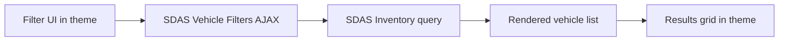

## What visitors see when Vehicle Filters is working

SDAS Vehicle Filters turns your inventory page into a searchable experience where shoppers narrow results without full page reloads.

Visitors typically see:

- A **filter area** with controls like make, model, year, price, body style, and condition.
- A **results grid** of matching vehicles that updates instantly when filters change.
- A **URL that updates** as they filter, so they can bookmark or share a link and return to the same results later.
- **Back/forward buttons** that step through previous filter settings instead of taking them to a different page.

<Callout kind="info">

SDAS Vehicle Filters depends on SDAS Inventory. Activate and configure SDAS Inventory first so the filters have an inventory source to query.

</Callout>

At a high level, you place shortcodes on a WordPress page, and the plugin takes care of:

- Reading filter choices from the page.
- Sending those choices to SDAS Inventory.
- Updating the results grid via AJAX.
- Keeping the browser URL and tracking IDs in sync.

## Core building blocks: the two shortcodes

You build your inventory search page with two shortcodes:

- **`[sdas_filters]`** — shows the filter panel that visitors interact with.
- **`[sdas_filter_results]`** — shows the vehicle results grid that updates when filters change.

You can place these shortcodes:

- Directly in a WordPress **page** (classic editor or block editor).
- Inside a **Shortcode** block.
- In a **template part** or reusable block that appears on your inventory page.

<Callout kind="tip">

Keep things simple: use one clear filter area and one clear results area per page. This makes it easier for visitors and for the plugin’s scripts.

</Callout>

### `[sdas_filters]` — the filter panel

`[sdas_filters]` renders the filter controls visitors use to narrow inventory. The plugin decides which filter types to show based on your inventory configuration.

Common behavior:

- Shows controls like **make**, **model**, **price range**, **year range**, **body style**, and **condition**.
- Updates the results grid automatically when a visitor changes a filter.
- Adjusts available options (for example, available models) based on what is in your actual inventory.

**Common options (optional):**

You can add attributes inside the shortcode if a developer has advised you to tweak behavior. For non-technical admins, these are the most useful:

- `layout="vertical"` — stacks filters in a sidebar column.
- `layout="horizontal"` — arranges filters in a bar above the results (often the default).
- `show_reset="no"` — hides the default "clear filters" control if you have a custom one.
- `filter_types="make,model,year_range,price_range"` — limits which filters appear.

Example (typed in a Shortcode block):

```text
[sdas_filters layout="horizontal" show_reset="yes"]
```

If you are not sure which options to use, leave them out and rely on the defaults.

### `[sdas_filter_results]` — the results grid

`[sdas_filter_results]` renders the actual inventory cards and pagination that respond to filter changes.

Common behavior:

- Shows a **grid or list** of vehicles with photos, prices, and key specs.
- Includes **pagination** or a **Load more** button.
- Updates in place when visitors change filters or move between pages.
- Honors any default inventory rules from SDAS Inventory (for example, only in-stock vehicles).

**Common options (optional):**

- `per_page="24"` — change how many vehicles appear per page.
- `pagination="load_more"` — use a “Load more” button instead of page numbers.

Example:

```text
[sdas_filter_results per_page="24" pagination="numbers"]
```

If you are mainly focused on UX and content, you can use the shortcode without attributes and adjust later with developer help if needed.

## Setup: create an inventory-with-filters page

Use these steps to add SDAS Vehicle Filters to your public site using the block editor.

<Steps>

<Step title="Confirm prerequisites" icon="check-circle">

Before you create the page, confirm:

- SDAS Inventory is installed, active, and already showing vehicles somewhere (even if it is a simple archive).
- SDAS Vehicle Filters is installed and active.
- You have at least one **public page** where you want shoppers to search inventory (for example, "Search Inventory" or "All Vehicles").

Success signal: You can see vehicles in the WordPress admin under Inventory (or equivalent), and both plugins appear as active in the Plugins list.

</Step>

<Step title="Create or edit your inventory search page" icon="edit">

In WordPress:

- Go to **Pages → Add New** (or edit an existing "Search Inventory" page).
- Give the page a clear title such as **Search Inventory** or **View All Vehicles**.
- Make sure the page uses your standard site template and header so it feels consistent with the rest of the site.

Success signal: The page exists in the Pages list and opens in the block editor with your usual layout template selected.

</Step>

<Step title="Add the filter panel shortcode" icon="settings">

Inside the page content:

- Add a **Shortcode** block (search “Shortcode” in the block inserter).
- In the block, type:

  ```text
  [sdas_filters]
  ```

- Optionally add a heading above it such as **Filter vehicles**.

Place this block above or beside where you plan to show the results.

Success signal: When you preview the page, you see a filter panel with dropdowns, sliders, or checkboxes, even if changing them does not yet feel instant.

</Step>

<Step title="Add the results grid shortcode" icon="monitor">

Below the filters:

- Add another **Shortcode** block.
- In the block, type:

  ```text
  [sdas_filter_results]
  ```

- Optionally add a heading like **Results** or **Available vehicles** just above the block.

Success signal: When you preview the page, you see a list or grid of vehicles under the filters. At this stage, filter changes may briefly reload or feel basic; the plugin’s JavaScript still wires things up behind the scenes.

</Step>

<Step title="Adjust basic page layout" icon="layout-grid">

If your theme supports columns:

- Wrap the filter shortcode and results shortcode in a **Columns** block:
  - Put `[sdas_filters]` in the **left** column for a sidebar-style layout.
  - Put `[sdas_filter_results]` in the **right** column for wider results.

If your theme is single-column only:

- Keep `[sdas_filters]` in a section above `[sdas_filter_results]`.
- Use headings and spacing blocks so the layout feels clear on desktop and mobile.

Success signal: The page feels organized, with a clear filter area and a clear results area, even before you fine-tune design.

</Step>

<Step title="Test filtering behavior on desktop" icon="play-circle">

Open the page in a normal browser tab (not the editor):

- Change a few filters (for example, pick a make, then a model, then adjust price).
- Watch that the **results update** without a full page reload.
- Try moving between pages of results, if pagination is visible.

Success signal: Each filter change causes the results to update in place; you do not see the entire page flash or reload.

</Step>

<Step title="Test on mobile screens" icon="monitor">

On a phone or using browser device tools:

- Open the same inventory page.
- Confirm the filter area is usable:
  - Text is readable.
  - Controls are not cut off or hidden.
  - You can open and close dropdowns easily.
- Apply filters and scroll; the grid should still update without full reloads.

Success signal: Mobile visitors can comfortably adjust filters and see updated vehicles without pinching or zooming awkwardly.

</Step>

<Step title="Test URL sharing and back button" icon="arrow-right">

With filters applied:

- Look at the browser **address bar**. The URL should include query parameters that reflect active filters.
- Copy the URL and open it in a new tab or incognito window. The page should open with the same filters and results already applied.
- Use the **Back** and **Forward** buttons to step through previous filter states. Filters and results should stay in sync.

Success signal: The URL always matches the active filter state, and going back or sharing the link reproduces the same search.

</Step>

</Steps>

## Visitor experience checklist

Use this checklist to confirm the page feels good for shoppers:

- The page opens with a **useful default set** of vehicles (not empty).
- Filters use **clear labels** (for example, “Body style” instead of “Body”).
- Changing filters updates results **quickly** and does not scroll the page to the top unexpectedly.
- The **number of matching vehicles** makes sense for each filter combination.
- Empty states are clear (for example, a message when no vehicles match current filters).

<Callout kind="tip">

When in doubt, test the page with someone who does not work on the site. Ask them to "find all SUVs under a certain price" and watch how they use the filters.

</Callout>

## Common shortcode layouts for admins

You do not need custom templates to get a professional layout. These patterns work well in the block editor.

### Top filters, results below (single-column)

Use this when your theme is mainly single-column or on mobile-first sites.

1. Add a **Heading** block: “Search inventory”.
2. Add a **Shortcode** block with:

   ```text
   [sdas_filters]
   ```

3. Add some spacing.
4. Add another **Heading** block: “Results”.
5. Add a **Shortcode** block with:

   ```text
   [sdas_filter_results]
   ```

This layout works in almost any theme and is easy to understand.

### Sidebar filters with main results (two-column)

If your theme’s page template or block pattern supports columns:

1. Add a **Columns** block with two columns (for example, 30% / 70%).
2. In the left column:
   - Add a heading like **Filter vehicles**.
   - Add a **Shortcode** block:

     ```text
     [sdas_filters layout="vertical"]
     ```

3. In the right column:
   - Add a heading like **Available vehicles**.
   - Add a **Shortcode** block:

     ```text
     [sdas_filter_results per_page="24"]
     ```

This gives you a classic sidebar-and-grid layout without writing PHP.

## Troubleshooting for WordPress admins

This section focuses on symptoms you can see from the browser and the admin, without digging into code.

### Filters do not update the results

Symptoms:

- Changing a filter appears to do nothing.
- The page only updates when you manually reload.

Checks:

- Confirm **both** shortcodes appear on the same page:
  - `[sdas_filters]`
  - `[sdas_filter_results]`
- Make sure the shortcodes are in **Shortcode** blocks or plain content, not inside another complex builder widget that strips or escapes them.
- Try temporarily switching to a default WordPress theme (for example, Twenty Twenty-One) and test the same page. If it works there, your main theme may be interfering with the plugin’s scripts.

If the problem only occurs in your main theme, share the page markup and theme details with a developer for deeper inspection.

### Spinner or loading state never ends

Symptoms:

- A spinner or “Loading…” message appears after you change filters and never goes away.
- Results never return, even after waiting.

Checks:

- Open your browser’s **Network** tab (or ask a developer to do this) and change a filter:
  - If you see an error or redirect in the AJAX request, share that with your technical team.
- Check for **JavaScript errors** in the console; some themes or third-party scripts can break the filter script.
- Make sure the page is not using heavy caching that captures and replays an old loading state.

Temporary test:

- Disable page-level or HTML caching plugins for the inventory page.
- Test again; if filtering works, adjust caching rules to respect AJAX behavior.

### URL does not change when filters change

Symptoms:

- Filters work and results update, but the browser URL stays the same.
- Bookmarking or sharing the page does not preserve filters.

Checks:

- Confirm you are not inside an **iframe** or a custom JavaScript router that overrides browser history.
- Avoid wrapping the inventory page in other page-builder “app” containers that hijack navigation.
- Check with your technical team whether custom scripts disable history updates on this page.

Even when the URL does not change, SDAS Vehicle Filters can still filter inventory, but visitors lose shareable URLs and back-button history.

### Models dropdown is empty

Symptoms:

- The **Make** dropdown has options, but the **Model** dropdown is empty or never updates when you choose a make.
- Other filters appear to work.

Checks:

- Confirm SDAS Inventory actually has vehicles for that make and with non-empty model values in the admin.
- Try another make; if some makes show models and others do not, the issue may be with the inventory data.
- Clear any browser caching and test in a private window in case an old script is cached.

If the models dropdown remains empty for all makes, share this symptom with a developer; they may check the `sdas_vf_get_models` AJAX behavior described in the advanced section.

### Results do not match expectations

Symptoms:

- You know there are vehicles in inventory, but some do not appear in the filtered results.
- The number of results seems too high or too low for given filters.

Checks:

- Visit a **non-filtered inventory** page (for example, a simple archive using SDAS Inventory alone) and search for the same vehicles there.
  - If vehicles are missing there as well, adjust **SDAS Inventory settings** and data first.
- Try the same filter combinations on the inventory page and a filtered page:
  - If they differ, record which combinations look wrong and share screenshots and URLs with technical support.
- Temporarily remove custom attributes from the shortcodes (for example, use `[sdas_filter_results]` alone) to rule out configuration issues.

<Callout kind="info">

SDAS Vehicle Filters builds on whatever SDAS Inventory exposes. If inventory is misconfigured or incomplete, filters will never feel right until the underlying data is corrected.

</Callout>

## Advanced (developers)

This section collects technical details and examples for theme developers and integrators.

### Block-editor layouts vs. custom templates

Most sites can use block-editor shortcodes only. If you maintain custom templates, you can mirror the same structure in PHP or HTML.

#### Two-column layout: filters sidebar + results main

<CodeGroup tabs="HTML">

```html
<div class="vf-page vf-page--two-column">

  <div class="vf-layout">
    <aside class="vf-sidebar" aria-label="Vehicle filters">
      <div class="vf-filters" id="vf-filters-sidebar">
        [sdas_filters]
      </div>
    </aside>

    <main class="vf-main" id="vf-results-main" aria-live="polite">
      <div class="vf-results-grid" id="vf-results-grid">
        [sdas_filter_results]
      </div>
    </main>
  </div>

</div>
```

</CodeGroup>

Key points:

- Use stable selectors like `#vf-filters-sidebar` and `#vf-results-grid`.
- Let the plugin’s JavaScript bind to the shortcodes and update the results container via AJAX.

#### Top-bar filters with results below

<CodeGroup tabs="HTML">

```html
<div class="vf-page vf-page--top-filters">

  <header class="vf-header">
    <h1 class="vf-title">Search Inventory</h1>
  </header>

  <section class="vf-filters-bar" id="vf-filters-bar" aria-label="Vehicle filters">
    <div class="vf-filters vf-filters--horizontal">
      [sdas_filters]
    </div>
  </section>

  <section class="vf-results-section" aria-live="polite">
    <div class="vf-results-grid" id="vf-results-grid">
      [sdas_filter_results]
    </div>
  </section>

</div>
```

</CodeGroup>

#### Minimal PHP template with both shortcodes

<CodeGroup tabs="PHP">

```php
<?php
/**
 * Template Name: Inventory with Filters
 */

get_header();
?>

<main id="primary" class="site-main vf-page vf-page--template">

  <section class="vf-filters-wrapper" id="vf-filters-wrapper" aria-label="Vehicle filters">
    <div class="vf-filters">
      <?php echo do_shortcode('[sdas_filters]'); ?>
    </div>
  </section>

  <section class="vf-results-wrapper" id="vf-results-wrapper" aria-live="polite">
    <div class="vf-results-grid" id="vf-results-grid">
      <?php echo do_shortcode('[sdas_filter_results]'); ?>
    </div>
  </section>

</main>

<?php
get_footer();
```

</CodeGroup>

Keep containers like `#vf-filters-wrapper` and `#vf-results-grid` consistent across initial load and AJAX updates.

### AJAX actions and assets

SDAS Vehicle Filters uses standard WordPress AJAX with these key actions:

- `sdas_vf_filter_vehicles` — receives filter state and returns updated vehicle results (markup or JSON).
- `sdas_vf_get_models` — returns models for a selected make, used to populate dependent dropdowns.

The plugin typically enqueues these assets on pages that contain its shortcodes or widgets:

- `assets/css/filters.css` — base styling for filter UI and results.
- `assets/js/filters.js` — front-end logic for reading filter state, calling AJAX, and updating the DOM.
- `assets/vendor/nouislider/nouislider.min.css` and `assets/vendor/nouislider/nouislider.min.js` — slider library for price, year, and similar ranges.

Most themes do not need to enqueue these manually; they are attached automatically when `[sdas_filters]` or `[sdas_filter_results]` render.

### Inventory and filter interaction flow

Conceptual flow between theme, filters, and inventory:



Key interactions:

- Theme provides containers and visual markup.
- Vehicle Filters reads URL and form state and translates it into SDAS Inventory query parameters.
- Inventory returns the matching vehicles; the plugin handles caching for repeated combinations.
- The results grid in the theme updates without a full page refresh.

### URL state and tracking identifiers

SDAS Vehicle Filters also coordinates:

- **Shareable URLs**: keeps query-string parameters in sync with active filters and pagination.
- **Click ID preservation**: stores tracking identifiers such as `gclid` or `fbclid` in cookies when they appear in the URL.
- **Integration with SDAS Tracking Hub**: ensures leads generated from filtered inventory pages can be tied back to acquisition sources.

If you rely on SDAS Tracking Hub or other analytics, ensure inventory pages use SDAS Vehicle Filters consistently so tracking IDs and filter state are preserved throughout the session.

## Related backend documentation

For deeper configuration, hooks, and server-side behavior, refer to the backend plugin docs.

<Columns cols={1}>

<Card
  title="SDAS Vehicle Filters plugin reference"
  href="/plugins/sdas-vehicle-filters"
  icon="book-open"
  cta="Open backend docs"
>

Learn how the SDAS Vehicle Filters plugin is configured, which hooks are available, and how it layers AJAX and caching on top of SDAS Inventory.

</Card>

</Columns>