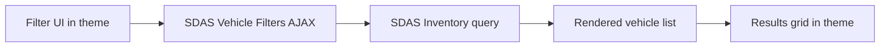

## What SDAS Vehicle Filters does on the front end

SDAS Vehicle Filters adds AJAX-driven filtering on top of SDAS Inventory so visitors can refine vehicle lists without full page reloads.

The plugin wires SDAS Inventory queries to an AJAX endpoint, manages URL/query-string state for filters, and applies caching so repeated filter combinations resolve quickly.

<Callout kind="info">

SDAS Vehicle Filters depends on SDAS Inventory. Activate and configure SDAS Inventory first so the filters have an inventory source to query.

</Callout>

At a high level, you provide the UI (filter controls and results grid markup) in your theme, and SDAS Vehicle Filters connects that UI to SDAS Inventory via shortcodes, front-end JavaScript, URL handling, and cache-aware queries.

## Purpose, layering, and theme responsibilities

SDAS Vehicle Filters sits between your theme templates and SDAS Inventory:

- SDAS Inventory handles **vehicle data and querying**.
- SDAS Vehicle Filters handles **filter UI, AJAX behavior, URL state, and tracking cookies**.
- Your theme handles **page layout, containers, and card markup**.

You typically:

- Drop the `[sdas_filters]` shortcode where you want filter controls.
- Drop the `[sdas_filter_results]` shortcode where you want the AJAX-updating results grid.
- Provide CSS and layout in your theme so the filters and results match your design system.

<Callout kind="info">

You rarely need to call the plugin’s AJAX endpoints manually. In most cases, the built-in JavaScript wires the shortcodes, containers, URL state, and AJAX endpoints together automatically.

</Callout>

## Shortcodes

Use shortcodes to render both the filter panel and the results grid. The plugin’s JavaScript then binds these elements to the appropriate AJAX endpoints and URL state.

<Callout kind="info">

Place shortcodes inside templates or page content, not inside other shortcodes or complex builders that aggressively rewrite markup. Keep the top-level containers predictable so the plugin’s scripts can find them.

</Callout>

### `[sdas_filters]` shortcode

`[sdas_filters]` renders the filter UI (such as make, model, year, price, body type) and connects changes to AJAX updates on the results container.

<CodeGroup tabs="PHP">

```php
<?php
// Inside a page template or a block that renders raw shortcodes.
echo do_shortcode('[sdas_filters]');
?>
```

</CodeGroup>

By default, the shortcode outputs a horizontal filter layout with common vehicle filter types, includes result counts, and a reset control. You can adjust this behavior using attributes.

#### Attributes

<ParamField body="layout" param-type="string" required="false" show-location="false">

Filter layout variant. Defaults to `horizontal`. Use this to switch between supported layout styles in your theme (for example, `vertical` in a sidebar).

</ParamField>

<ParamField body="show_counts" param-type="string" required="false" show-location="false">

Whether to show matching result counts on filter options. Defaults to `yes`. Set to `no` to hide counts and render filters without per-option totals.

</ParamField>

<ParamField body="show_reset" param-type="string" required="false" show-location="false">

Whether to render a reset/clear-filters control in the UI. Defaults to `yes`. Set to `no` if you provide a custom reset button elsewhere.

</ParamField>

<ParamField body="filter_types" param-type="string" required="false" show-location="false">

Comma-separated list of filter dimensions to render. Defaults to `make,model,year_range,price_range,body_type,condition,transmission,seats`. Use this to include or exclude filters based on available data.

</ParamField>

<ParamField body="filter_order" param-type="string" required="false" show-location="false">

Custom ordering for filters. Defaults to an empty value, which uses the plugin’s default ordering. Provide a comma-separated list matching `filter_types` to control visual order.

</ParamField>

<ParamField body="target_selector" param-type="string" required="false" show-location="false">

CSS selector for the results container that should refresh when filters change. Defaults to `auto`, where the plugin chooses a target based on nearby `[sdas_filter_results]` output.

</ParamField>

<ParamField body="auto_detect" param-type="string" required="false" show-location="false">

Whether the plugin should auto-detect available filters from inventory data and page context. Defaults to `yes`. Set to `no` if you want strictly the filters you specify in `filter_types`.

</ParamField>

<Callout kind="info">

If you provide both `filter_types` and `auto_detect=yes`, the plugin starts with your list and may still adapt available options based on SDAS Inventory data for the current site.

</Callout>

### `[sdas_filter_results]` shortcode

`[sdas_filter_results]` renders the vehicle results grid and handles pagination. The plugin’s JavaScript replaces this grid via AJAX when filters change.

<CodeGroup tabs="PHP">

```php
<?php
// Inside a page template or a block that renders raw shortcodes.
echo do_shortcode('[sdas_filter_results]');
?>
```

</CodeGroup>

On initial page load, the shortcode queries SDAS Inventory to show a page of vehicles. When filters or pagination change, the plugin calls the AJAX endpoint and updates this container in place.

#### Attributes

<ParamField body="per_page" param-type="integer" required="false" show-location="false">

Number of vehicles to show per page. Defaults to `12`. Increase or decrease this to balance scroll depth and page weight.

</ParamField>

<ParamField body="pagination" param-type="string" required="false" show-location="false">

Pagination style. Supported values include `numbers`, `simple`, and `load_more`. Defaults to `numbers`. Use `load_more` when you prefer a single-page infinite feel triggered by a button.

</ParamField>

<ParamField body="card_style" param-type="string" required="false" show-location="false">

Visual style variant for individual vehicle cards. Defaults to `default`. Match this to your theme’s design tokens or use it to switch between pre-defined card layouts.

</ParamField>

<Callout kind="info">

The shortcode controls **what** is rendered and **how many** vehicles appear; your theme CSS controls **how** the cards look. Coordinate `card_style` with your theme’s class names and styles.

</Callout>

## Copy/paste layouts

Start from these copy/paste-ready layouts to wire `[sdas_filters]` and `[sdas_filter_results]` into your theme with stable containers that the plugin’s JavaScript can bind to automatically.

<Callout kind="tip">

Keep container selectors (`id` or class names) stable over time. SDAS Vehicle Filters uses these containers to attach behavior and update results via AJAX.

</Callout>

### Two-column layout: filters sidebar + results main

This pattern puts filters in a sidebar on the left and results on the right.

<CodeGroup tabs="HTML">

```html
<div class="vf-page vf-page--two-column">

  <div class="vf-layout">
    <aside class="vf-sidebar" aria-label="Vehicle filters">
      <div class="vf-filters" id="vf-filters-sidebar">
        [sdas_filters]
      </div>
    </aside>

    <main class="vf-main" id="vf-results-main" aria-live="polite">
      <div class="vf-results-grid" id="vf-results-grid">
        [sdas_filter_results]
      </div>
    </main>
  </div>

</div>
```

</CodeGroup>

Notes:

- Use clear, dedicated selectors like `#vf-filters-sidebar` and `#vf-results-grid` so integration scripts can target them.
- The plugin’s front-end JavaScript binds to the `[sdas_filters]` and `[sdas_filter_results]` output and handles AJAX automatically when these shortcodes render on the page.

### Top-bar filters with results below

This pattern keeps filters above the grid in a single column, useful for narrower layouts or mobile-first designs.

<CodeGroup tabs="HTML">

```html
<div class="vf-page vf-page--top-filters">

  <header class="vf-header">
    <h1 class="vf-title">Search Inventory</h1>
  </header>

  <section class="vf-filters-bar" id="vf-filters-bar" aria-label="Vehicle filters">
    <div class="vf-filters vf-filters--horizontal">
      [sdas_filters]
    </div>
  </section>

  <section class="vf-results-section" aria-live="polite">
    <div class="vf-results-grid" id="vf-results-grid">
      [sdas_filter_results]
    </div>
  </section>

</div>
```

</CodeGroup>

Notes:

- Keep the `.vf-filters-bar` and `.vf-results-grid` containers present on all states (initial load and AJAX updates).
- As long as `[sdas_filters]` and `[sdas_filter_results]` render inside stable containers, the plugin’s scripts connect filter changes to results updates without extra wiring.

### Minimal PHP template with both shortcodes

This snippet shows a minimal custom template that renders both shortcodes with `do_shortcode` and wraps them in predictable containers.

<CodeGroup tabs="PHP">

```php
<?php
/**
 * Template Name: Inventory with Filters
 */

get_header();
?>

<main id="primary" class="site-main vf-page vf-page--template">

  <section class="vf-filters-wrapper" id="vf-filters-wrapper" aria-label="Vehicle filters">
    <div class="vf-filters">
      <?php echo do_shortcode('[sdas_filters]'); ?>
    </div>
  </section>

  <section class="vf-results-wrapper" id="vf-results-wrapper" aria-live="polite">
    <div class="vf-results-grid" id="vf-results-grid">
      <?php echo do_shortcode('[sdas_filter_results]'); ?>
    </div>
  </section>

</main>

<?php
get_footer();
```

</CodeGroup>

Notes:

- The PHP template keeps containers like `#vf-filters-wrapper` and `#vf-results-grid` consistent, even as content changes.
- With both shortcodes present, SDAS Vehicle Filters enqueues its assets and binds AJAX behavior to these containers automatically; you only need to adjust CSS and layout to match your theme.

## Typical front-end architecture

A standard integration has three visible pieces on the public site:

1. A **filter UI** with form controls for dimensions like price, mileage, body style, and similar criteria. Exact dimensions vary by installation.
2. A **results grid** that lists vehicles matching the current filters and updates via AJAX.
3. A **URL state pattern** (query string or similar) that reflects the active filters so visitors can share links and use back/forward navigation.

Internally, SDAS Vehicle Filters:

- Reads the active filter state from the URL and your filter form.
- Translates that state into an SDAS Inventory query.
- Fetches matching vehicles over AJAX.
- Returns rendered markup or JSON (depending on your configuration) to update the grid.

### Visitor UX in practice

From the visitor’s perspective, a well-integrated page feels like a single-screen search app:

- The page loads with an initial list of vehicles, often with default filters applied.
- Changing any filter control triggers an AJAX request rather than a full reload.
- The results grid updates in place, and the browser URL updates so the current state can be bookmarked or shared.
- Navigating back and forward restores prior filter states, thanks to the URL handling and caching in the plugin.

## Core pieces you build in the theme

You control the markup and layout while relying on the plugin for data and behavior. A typical theme integration includes:

- A **filter container** element (for example, a form or a div wrapping filter controls).
- Individual **filter controls** (select boxes, checkboxes, sliders) mapped to filter dimensions.
- A **results container** element where the plugin injects the updated inventory markup.
- Optional **loading states** and empty-state messages.

<Callout kind="tip">

Keep your filter and results containers stable in the DOM. Avoid replacing them entirely with JavaScript; let SDAS Vehicle Filters target and update them consistently.

</Callout>

You usually wire these elements together via:

- CSS classes or data attributes that the plugin looks for.
- JavaScript hooks that call the plugin’s AJAX endpoint and handle responses.
- URL parsing logic that reads the current filter state and initializes controls accordingly. In many setups, the plugin exposes helpers for this.

## Integration steps for site builders

Use these steps as a high-level pattern for wiring SDAS Vehicle Filters into a custom theme. Exact selectors and hooks depend on your installation.

<Steps>

<Step title="Prepare an inventory archive template" icon="code">

Create or edit the template that displays your main inventory archive (for example, `archive-vehicle.php` or a custom page template) so it:

- Loads the standard page header and layout from your theme.
- Calls into SDAS Inventory to output an initial set of vehicles.
- Includes placeholder containers for both the filter UI and the results grid.

Success signal: The page shows an initial list of vehicles with no AJAX yet, backed by SDAS Inventory.

</Step>

<Step title="Add shortcodes for filters and results" icon="code">

Within your template, place the shortcodes where you want the filter panel and results grid to appear.

For example:

- Place `[sdas_filters]` above or beside the inventory area.
- Place `[sdas_filter_results]` where you want the grid and pagination.

Success signal: The page renders a filter panel and a results grid, both backed by SDAS Inventory, but changing filters still requires a full page reload until the JavaScript initializes.

</Step>

<Step title="Add a filter UI container and controls" icon="settings">

Inside the filter area, ensure the shortcode output or your wrapper markup provides a logical structure for controls that map cleanly to your inventory fields.

For example, you might include:

- Dropdowns for typical vehicle attributes (make, model, body style).
- Range inputs or paired fields for price or mileage.
- Checkboxes or toggles for flags like new/used, featured, or in-transit.

Label these controls clearly as **typical** filters in your code comments, since exact dimensions differ between installations.

Success signal: Visitors can change controls, but nothing updates yet; you still see the initial results only.

</Step>

<Step title="Mark up the results grid for AJAX updates" icon="monitor">

Wrap the vehicle list in a dedicated container element that SDAS Vehicle Filters can target during AJAX updates.

Common patterns include:

- A grid or list with a stable `id` or class name.
- Inner markup where each vehicle card is a repeatable element.
- An area for pagination or a "load more" control, if you use paged inventory.

Success signal: Your initial page render includes a distinct, easily-targeted container around the inventory results.

</Step>

<Step title="Connect filter changes to AJAX requests" icon="zap">

Wire your filter controls to trigger AJAX requests through SDAS Vehicle Filters when they change. Depending on your setup, this might involve:

- Listening for `change` events on filter inputs and serializing the current filter state.
- Calling a provided AJAX endpoint that returns updated inventory markup.
- Replacing the contents of the results container with the response.
- Showing a loading indicator while the request is in flight.

Ensure you update the browser URL to reflect the active filters, so reloading or sharing the URL restores the same results.

Success signal: Changing a filter control updates the results grid without a full page reload, and the URL changes to include filter parameters.

</Step>

<Step title="Hydrate controls from URL state" icon="arrow-right">

On page load and on back/forward navigation, read the current URL state and set your filter controls to match.

Typical behaviors:

- Parsing query parameters to pre-fill dropdowns and checkboxes.
- Triggering an initial AJAX load if the URL contains filters different from your defaults.
- Handling known edge cases like invalid or missing filter values by falling back to defaults.

Success signal: Loading a bookmarked filtered URL initializes both the controls and the results grid to the expected state.

</Step>

<Step title="Validate caching and performance" icon="bar-chart">

Exercise common filter combinations and watch:

- Network requests: the plugin should reuse cached results when the same filter combination repeats, depending on configuration.
- Page responsiveness: updating filters should feel snappy even under load.
- Edge cases: applying many filters at once or clearing filters should still return consistent results.

Success signal: Repeat visits to popular filter combinations return quickly, and you do not see unexpected stale data.

</Step>

</Steps>

## Front-end behavior and assets

SDAS Vehicle Filters uses standard WordPress AJAX endpoints and enqueued assets to power filtering behavior.

Key AJAX actions:

- `sdas_vf_filter_vehicles` — main filter endpoint that receives filter state and returns updated vehicle results.
- `sdas_vf_get_models` — endpoint that returns models for a selected make, used to populate dependent dropdowns.

The plugin automatically enqueues assets on pages that contain its shortcodes or widget:

- `assets/css/filters.css` — base styles for filter UI and results integration.
- `assets/js/filters.js` — front-end logic for reading filter state, calling AJAX, and updating the DOM.
- `assets/vendor/nouislider/nouislider.min.css` and `assets/vendor/nouislider/nouislider.min.js` — slider library used for ranges such as price or year.

<Callout kind="info">

Most themes do not need to enqueue these assets manually. As long as the page includes `[sdas_filters]` and/or `[sdas_filter_results]`, the plugin adds the necessary CSS and JavaScript and wires them to your containers.

</Callout>

From the theme’s perspective, the main requirements are:

- Render the shortcodes in predictable locations.
- Provide containers and modifiers (classes, data attributes) that align with your design.
- Avoid interfering with the plugin’s scripts by removing or renaming key containers.

## How SDAS Vehicle Filters and SDAS Inventory interact

SDAS Vehicle Filters does not replace SDAS Inventory; it orchestrates how inventory is queried and displayed in response to filter changes.

Conceptually, the flow looks like this:



Key interactions:

- **Inventory source**: SDAS Inventory remains the single source of truth for vehicle data and query capabilities.
- **Filter translation**: SDAS Vehicle Filters maps browser-side filter state into inventory query parameters that SDAS Inventory understands.
- **Rendering**: Depending on your configuration, either the plugin or your theme template renders the individual vehicle cards, but the plugin coordinates which vehicles appear.
- **Caching**: The filter plugin applies caching on top of inventory queries so repeat filter combinations resolve faster. This is especially useful on high-traffic list pages.

<Callout kind="info">

If inventory appears inconsistent between the AJAX results and a non-AJAX inventory page, start by confirming SDAS Inventory settings and query scopes. The filter plugin builds on whatever SDAS Inventory exposes.

</Callout>

## Interactions with URL state and tracking

Beyond rendering filters and results, SDAS Vehicle Filters coordinates URL state and tracking identifiers so inventory pages participate correctly in analytics and attribution.

- **SDAS Inventory queries**: All vehicle data still comes from SDAS Inventory. The filter plugin translates filter state and pagination into inventory queries and never maintains its own separate vehicle store.
- **Shareable URL state**: The plugin keeps the browser URL in sync with active filters and pagination, so visitors can bookmark, share links, and use back/forward navigation without losing their search context.
- **Click ID preservation**: When visitors arrive with click IDs such as `gclid` or `fbclid` in the URL, the plugin preserves them in cookies. This enables downstream tracking and attribution layers, including SDAS Tracking Hub, to associate lead activity with the original acquisition source.

<Callout kind="info">

If you rely on SDAS Tracking Hub or another analytics layer, confirm that inventory and filter pages run SDAS Vehicle Filters so click IDs and filter state are preserved consistently across the visitor’s session.

</Callout>

## Front-end views and troubleshooting

Use these tabs to reference the plugin from three angles: the visitor experience you are building, the theme wiring you maintain, and common issues to check.

<Tabs>

<Tab title="Visitor experience" icon="users">

From the visitor’s perspective, a properly wired SDAS Vehicle Filters integration offers:

- **Instant feedback** when changing filters, thanks to AJAX-driven updates.
- **Predictable URLs** that reflect the current filters for bookmarking and sharing.
- **Consistent layouts** between initial page load and filtered states, since the theme controls markup.

When you demo or QA the experience, walk through it as a visitor:

- Load the main inventory page and confirm it starts with a relevant default set of vehicles.
- Apply several typical filters in sequence and ensure the grid updates without page reloads.
- Use the back button to step through previous filter states and confirm the filters and results stay in sync.
- Copy the URL with filters applied, open it in a new tab or incognito window, and ensure the page loads with the same filters active.

If any of这些 checks fail, investigate the theme wiring and URL handling before assuming inventory data issues.

</Tab>

<Tab title="Theme wiring" icon="code">

As a front-end developer, you own the structure and appearance of the filter experience. Keep the following responsibilities in mind:

- **Container structure**: Maintain stable filter and results containers with predictable selectors.
- **Control mapping**: Use meaningful names and attributes on inputs so they map clearly to inventory dimensions, even if the exact dimension set differs per site.
- **URL integration**: Ensure filter changes push URL updates, and initial page load reads from the URL into controls. Coordinate this behavior with any global routing or history logic in your theme.
- **Accessibility**: Provide clear labels, focus states, and keyboard navigation for filter controls and results. Treat the filter panel as a first-class form, even though it submits via AJAX.
- **Progress indicators**: Show loading states and empty-state messages so visitors understand when the grid is updating or when no vehicles match.

When you change markup or classes, verify that the plugin’s JavaScript still targets the correct elements. Avoid changes that break selector assumptions without updating the integration logic.

</Tab>

<Tab title="Troubleshooting" icon="alert-triangle">

When AJAX filtering does not behave as expected, work through these checks:

- **Inventory baseline**: Confirm SDAS Inventory alone returns the expected vehicles for similar queries. If the baseline inventory is off, fix that first.
- **Plugin activation**: Verify both SDAS Inventory and SDAS Vehicle Filters are active and not overridden by another inventory plugin or custom code.
- **Selector mismatches**: Inspect your filter and results containers in the DOM and confirm the selectors used by the plugin or integration script still match.
- **URL parsing**: Look at the browser URL when filters are applied. Check that parameters are well-formed and that reloading the page restores the same filter state.
- **Network requests**: Use browser dev tools to inspect AJAX calls:
  - Confirm requests are actually firing on filter changes.
  - Check response payloads to see whether updated markup or data looks correct.
  - Look for error responses or unexpected redirects.
- **Caching symptoms**: If results look stale, test with caching bypassed (for example, by using a development environment) to determine whether cache rules or inventory data are the root cause.

If you still see discrepancies between initial render and AJAX updates, compare the templates or rendering paths used for each. Align them so both use the same layout and query logic.

</Tab>

</Tabs>

## Related backend documentation

Use the backend-focused plugin documentation to understand configuration options, available hooks, and server-side behavior.

<Columns cols={1}>

<Card
  title="SDAS Vehicle Filters plugin reference"
  href="/plugins/sdas-vehicle-filters"
  icon="book-open"
  cta="Open backend docs"
>

Learn how the SDAS Vehicle Filters plugin is configured, which hooks are available, and how it layers AJAX and caching on top of SDAS Inventory.

</Card>

</Columns>